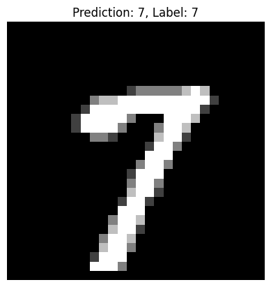
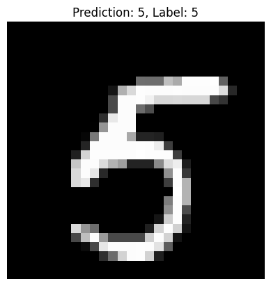
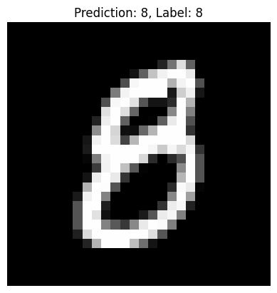
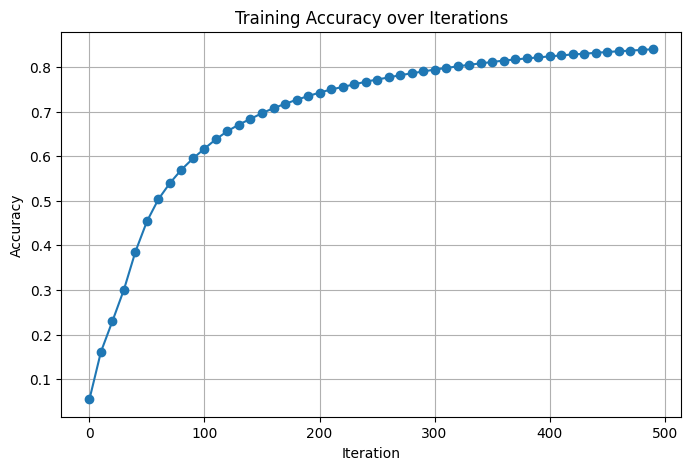

# Minst_Digits_Classifier

This project implements a **two-layer neural network** using **NumPy** to classify handwritten digits from the MNIST dataset. It is designed as an educational example to illustrate the underlying math and mechanics of neural networks.

---

## Architecture

The neural network has a simple **two-layer structure**:

- **Input layer \(A^{[0]}\)**: 784 units corresponding to the 28x28 pixel images.
- **Hidden layer \(A^{[1]}\)**: 10 units with **ReLU** activation.
- **Output layer \(A^{[2]}\)**: 10 units corresponding to the 10 digit classes with **softmax** activation.

### Forward Propagation

\[
\begin{align*}
Z^{[1]} &= W^{[1]} X + b^{[1]} \\
A^{[1]} &= \text{ReLU}(Z^{[1]}) \\
Z^{[2]} &= W^{[2]} A^{[1]} + b^{[2]} \\
A^{[2]} &= \text{softmax}(Z^{[2]})
\end{align*}
\]

### Backward Propagation

\[
\begin{align*}
dZ^{[2]} &= A^{[2]} - Y \\
dW^{[2]} &= \frac{1}{m} dZ^{[2]} (A^{[1]})^T \\
db^{[2]} &= \frac{1}{m} \sum dZ^{[2]} \\
dZ^{[1]} &= (W^{[2]})^T dZ^{[2]} \odot \text{ReLU}'(Z^{[1]}) \\
dW^{[1]} &= \frac{1}{m} dZ^{[1]} X^T \\
db^{[1]} &= \frac{1}{m} \sum dZ^{[1]}
\end{align*}
\]

### Parameter Update

\[
\begin{align*}
W^{[1]} &:= W^{[1]} - \alpha dW^{[1]} \\
b^{[1]} &:= b^{[1]} - \alpha db^{[1]} \\
W^{[2]} &:= W^{[2]} - \alpha dW^{[2]} \\
b^{[2]} &:= b^{[2]} - \alpha db^{[2]}
\end{align*}
\]

---

## Layer Shapes

| Layer | Shape       | Activation |
|-------|------------|------------|
| Input \(A^{[0]}\) | 784 × m    | -          |
| Hidden \(A^{[1]}\) | 10 × m     | ReLU       |
| Output \(A^{[2]}\) | 10 × m     | Softmax    |
| W1    | 10 × 784   | -          |
| b1    | 10 × 1     | -          |
| W2    | 10 × 10    | -          |
| b2    | 10 × 1     | -          |

*m = number of examples*

---

## Features

- Loads and preprocesses the MNIST dataset from a .npz file.
- Splits data into **training** and **development** sets.
- Implements **ReLU** and **softmax** activations.
- Performs **forward propagation**, **backpropagation**, and **gradient descent**.
- Provides **prediction** and **accuracy** evaluation.
- Visualizes predictions and accuracy using **Matplotlib**.

---

## Sample Predictions

Here are some predictions from the trained model:

  
  
  

*The images above show the input digit and the model’s predicted label.*

---

## Training Accuracy Plot

The training accuracy improves over iterations. Example plot:

  

*The x-axis represents iterations, and the y-axis represents accuracy.*

---

## Usage

1. Clone the repository.
2. Place the MNIST NPZ dataset in `Dataset/minst.npz`.
3. Run the notebook or script:

```bash
python classifier.ipynb
```

4. Observe the training process and final development set accuracy.

5. Visualize predictions with:
```python
test_prediction(index, W1, b1, W2, b2)
```

## Dependencies

- Python 3.8+
- NumPy
- Matplotlib


Install dependencies with:
```bash
pip install numpy matplotlib
```

## References & Inspiration

Original dataset and inspiration from Kaggle: [MNIST Digit Recognizer](https://www.kaggle.com/code/wwsalmon/simple-mnist-nn-from-scratch-numpy-no-tf-keras)

Video walkthrough of the math and coding: [YouTube](https://www.youtube.com/watch?v=w8yWXqWQYmU)

## License

This project is open-source and free to use for educational purposes.